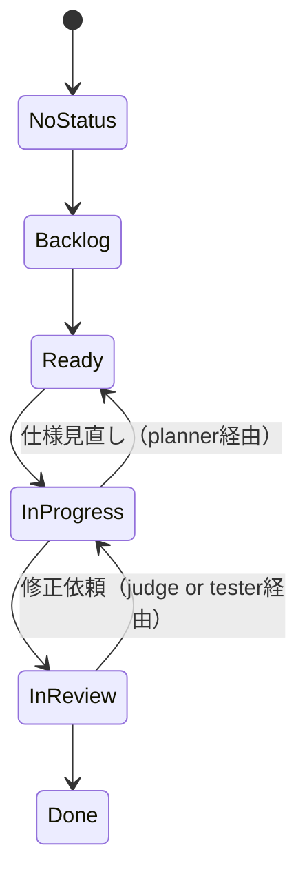

# Agents — マルチエージェント・ワークフロー（Draft, Minimal）

本書は **Who/How/Flow** を定義します。**What/Why/Done** は `requirements.md`（SSOT）を参照。

## 0. 層構造（Tiering）

* **Tier1**: **orchestrator** — *step2 以降すべての行動の起点*。`state` を操作し、tier2 に直接指示。
* **Tier2**: **planner / coder / judge** — orchestrator から直接指示を受ける中核。
* **Tier3**: **tester / researcher** — それぞれ **coder / planner** を補助。

## 1. 役割と責務（Minimal）

* **orchestrator（T1）**：

  * `state` を操作（No Status→Backlog→Ready→In Progress→In Review→Done）
  * tier2（planner / coder / judge）へ直接ディスパッチ
  * `reports` を見てルーティング（judgeへ送る or plannerへ戻す）
* **planner（T2）**：

  * `requirements.md` の保守（SSOT）／**tickets（作業単位）を発行**
  * 必要に応じて **researcher（T3）** を呼び出し、外部情報でハルシネーションを防止
* **coder（T2）**：

  * 実装・実験。`trace`（変更ログ）を記録、成果を `reports` に集約
* **tester（T3）**：

  * **coder が実装したテストを実行**し、**要約した結果を coder に返す**（ノイズ低減）
  * 合わせて `reports` に検証要約を残す
* **judge（T2）**：

  * `reports` と `trace` を基に最終判定（承認・差戻し）
* **researcher（T3）**：

  * planner の補助として、外部情報（WEB など）を調査・要約し、意思決定を支援
  * judge の指摘や coder の停滞を踏まえ、planner 要請で出動

## 2. 共有リソース（Containers）

* **tickets**：作業単位。**planner が発行**。
* **state**：進捗管理（No Status / Backlog / Ready / In Progress / In Review / Done）。**orchestrator が操作**。
* **trace**：変更ログ（日時・コマンド・git hash・設定差分・実行環境）。**judge が妥当性判断に使用**。
* **reports**（※`results` をリネーム）：

  * 「**何ができたか／できなかったか**」を明確化する要約置き場（表・図・短評）。
  * **orchestrator は reports を見て**「judge に回す／planner に戻す」を判断する。

---

## 3. ワークフロー（Mermaid・最小）

```mermaid
flowchart TD
  %% Tiers
  subgraph T1[Tier1]
    ORC[orchestrator\n(起点 / state操作 / 直接指示)]
  end
  subgraph T2[Tier2]
    PLN[planner\n(SSOT保守 / tickets発行)]
    COD[coder\n(実装/実験)]
    JDG[judge\n(最終判定)]
  end
  subgraph T3[Tier3]
    TST[tester\n(テスト実行/要約返却)]
    RSC[researcher\n(外部情報/ハルシ防止)]
  end

  %% Containers
  TCK[(tickets)]
  ST[(state)]
  TR[(trace)]
  RPT[(reports)]

  %% Step1: planner が tickets を用意（SSOTに基づく）
  PLN --> TCK

  %% Step2 以降の起点は orchestrator
  ORC --- ST
  ORC -->|assign| PLN
  ORC -->|assign| COD
  ORC -->|assign| JDG

  %% planner は必要に応じ researcher を起動
  PLN -->|必要に応じ| RSC
  RSC --> PLN

  %% coder 実装 -> tester 実行/要約 -> coder へ返却
  COD --> TST
  TST -->|要約| COD

  %% 生成物/記録
  COD --> TR
  COD --> RPT
  TST --> RPT

  %% orchestrator が reports を見て判断
  RPT --> ORC
  ORC -->|達成見込みあり/要審査| JDG
  ORC -->|未達/要要件見直し| PLN

  %% judge 判定
  JDG -->|承認| ORC
  JDG -->|差戻し| PLN
```

---

## 4. チケット状態遷移（state）— 操作者: orchestrator



* **操作原則（最小）**

  * `Backlog→Ready`：依存解消＆着手可能になったら
  * `Ready→In Progress`：担当割当済み
  * `In Progress→In Review`：`reports/trace` が揃ったら
  * `In Review→Done`：judge 承認

---

## 5. ハンドオフ契約（I/O Contract, Minimal）

| Role         | 受け取る                    | 返す                               | 主な完了条件         |
| ------------ | ----------------------- | -------------------------------- | -------------- |
| orchestrator | tickets, reports        | 指示（tier2へ）, state更新              | 正しいルーティング・状態遷移 |
| planner      | SSOT, judge/ORCのフィードバック | tickets更新, SSOT更新                | 受入基準の明確化/再定義   |
| coder        | tickets, configs        | 実装成果→**reports**, 記録→**trace**   | tester のスモークOK |
| tester       | 実装/テスト群                 | **要約レポート**（reports へ, coder に短報） | 受入基準の妥当な評価     |
| judge        | reports, trace          | 承認/差戻し                           | 要件適合の最終判断      |
| researcher   | plannerの問い              | 調査要約（外部根拠付き）                     | 判断材料が増えること     |

---

### 運用メモ（最小）

* **SSOTは `requirements.md`**。変更は必ずチケット経由で反映。
* **reports を中心に意思決定**：できた/できないを即時に可視化し、ORC が「judge 行き or planner 戻し」を決める。
* **tester の“要約”で coder の認知負荷を下げる**（生ログは trace、意思決定は reports）。
* **researcher は“必要なときだけ”planner が呼ぶ**（外部根拠の注入でハルシ対策）。

必要なら、このドラフトをあなたの実プロジェクトの **具体的なチケット名・状態定義の微調整**に合わせて最適化版も作れます。
